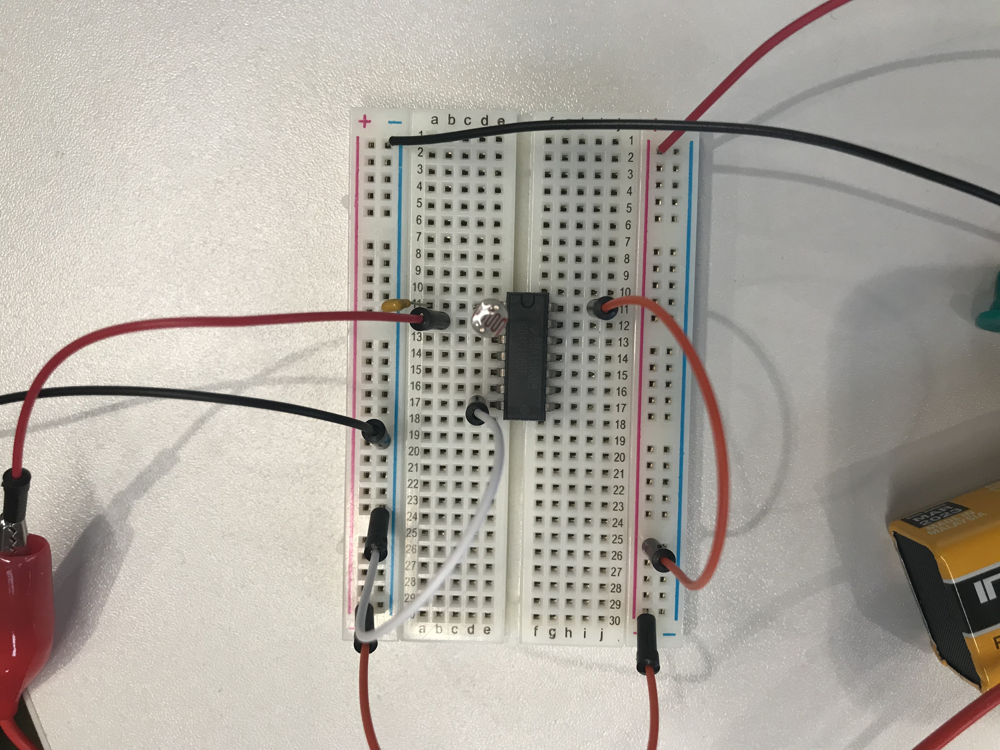

# Week 6

### Lab

#### 1. Oscillator with Photoresistor
  
Before swapping over to the correct oscillator and whilst our team was wondering why it wasn't working, we were playing around by using ourselves as conductors, as seen in [this video](https://youtu.be/ze6VY19KMs0).  
  
After using the new oscillator and with the help of Phoenix, we were able to get the circuit to make some really interesting sounds depending on the amount of light the phototransistor was exposed to.  
  
[Oscillator with a Photoresistor](https://youtu.be/PjpMYLplTiE)
  
  
*Above is a photo of the working circuit with a Photoresistor*
  
#### 2. Oscillator with Potentiometer  
  
We also built the same circuit but with a potentiometer. Our first attempt didn't work since we plugged in the two wires to the ground and power tips respectively, but we soon noticed that one of the wires has to be in contact with the middle pin.

[Oscillator with a Potentiometer](https://youtu.be/L3TXUs7S2iY)
