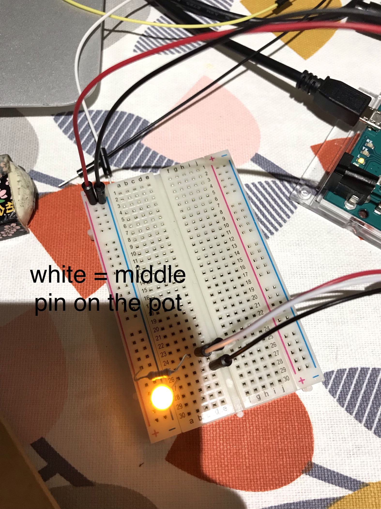

# Week 2

### Lab

#### 1. Series VS Parallel Circuit

*How many LEDs can you light up in a series circuit?*  
2 visibly bright LEDs

*How many LEDs can you light up in a parallel circuit?*  
We were running out of space on the breadboard after lighting up more than 10 LEDs, so pne of our group members calculated and our estimate was about 300.

#### 2. Serial Monitor
  
I set up a very basic push button and LED circuit to better understand the function of a serial monitor. Below is a screenshot of the serial monitor responding and the arduino code for it is saved [here](../tree/master/Week201).  
  
After this I moved on to the lab task of writing a three line story on the serial monitor, in which the code is saved [here](../tree/master/Week201). I initially had difficulties showing the first line on the monitor but managed to do so by including `while (!Serial);` as shown below:

    void setup() {
        Serial.begin(9600); //9600 is the baudrate = speed of bits per second
        while (!Serial); // this line waits to be loaded until the serial monitor is open
        Serial.println("Do you like chili?");
    }

#### 3. Photoresistor
  
  
This was very straight forward as it's very similar to a normal resistor.

#### 4. Potentiometer

  
Although I understood how to connect a potentiometer with in a circuit the first time around, I struggled quite a bit in understanding how the potentiometer works. However, I found an amazing [youtube video](https://www.youtube.com/watch?v=MImq6R6QCgg) with a very simple explanation and built the circuit again at home as review.

#### 5. Ultrasonic Sensor

  
This was also straightforward and I was able to build the circuit following the instructions under the link provided.