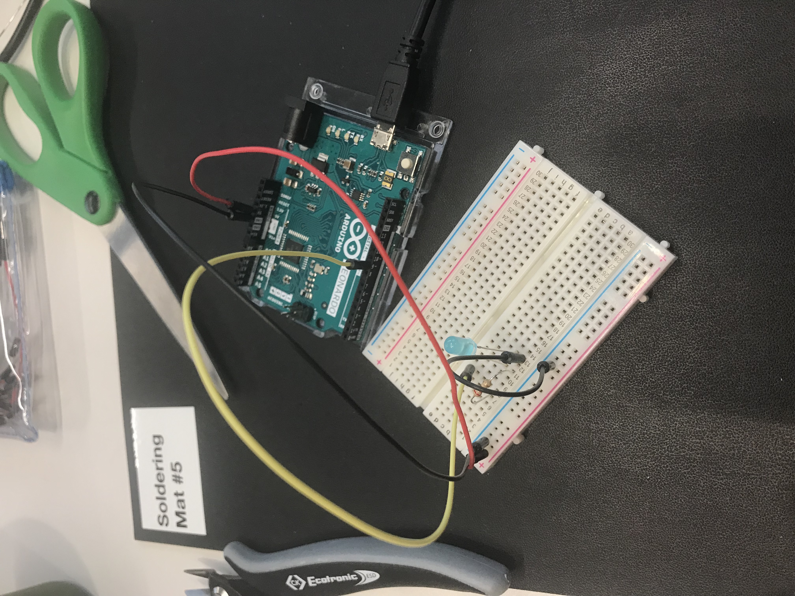
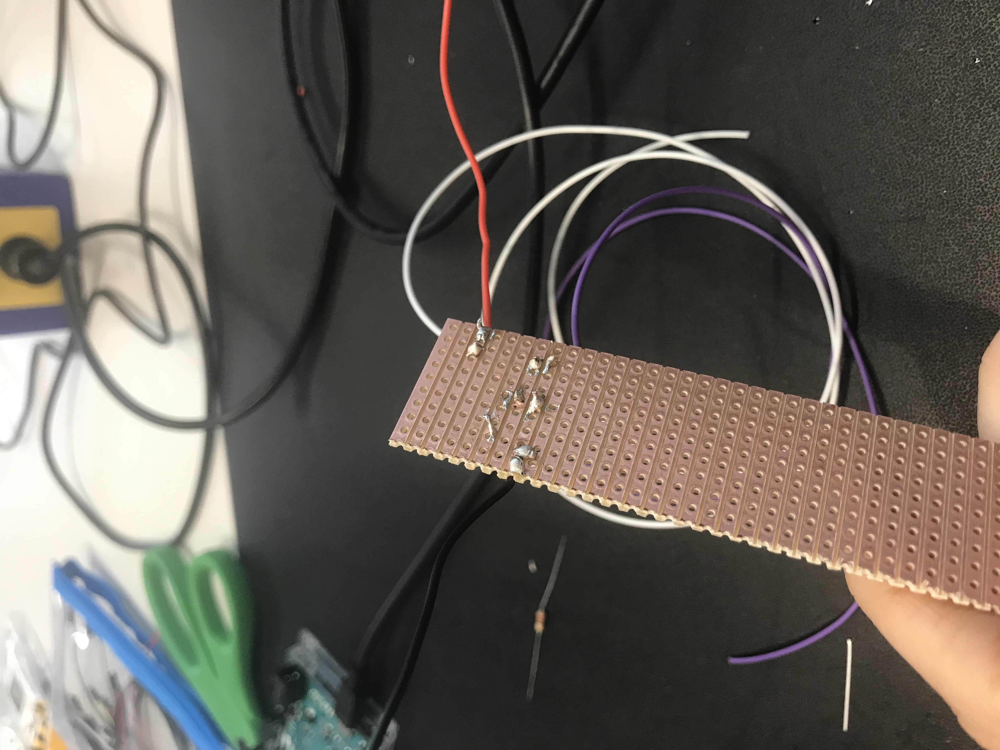
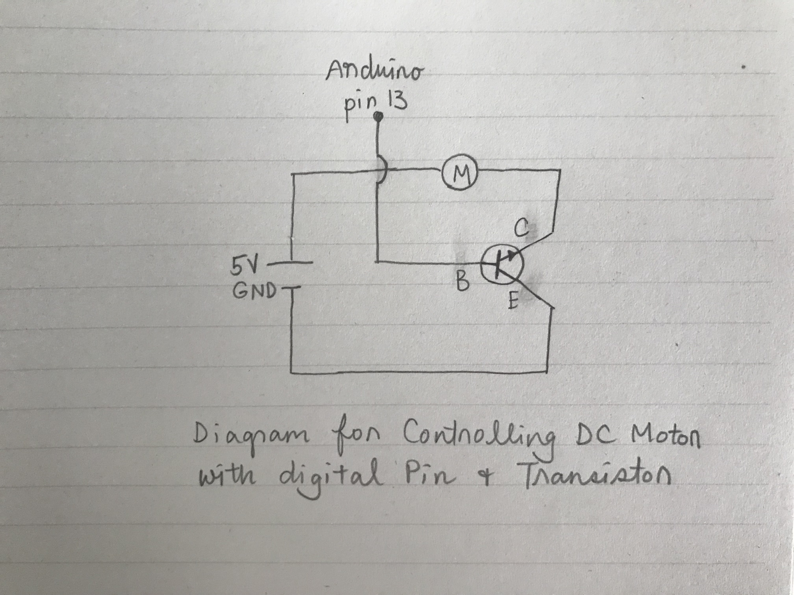

# Week 3

### Lab

#### 1. Playing with Fades + Soldering

  
  
  

After prototyping using the breadboard (first image), our group transferred the simple circuit on to a copper PCB board for soldering (second image). I found the soldering process quite challenging/messier than I had expected and will practice more. The final working circuit is shown in [this video](https://youtu.be/OkDVoLXT7cQ).  

#### 2. Potentiometer Review

[Potentiometer Review Video](https://youtu.be/_nV3cUQgEfk)

To review content from Week 2, I rebuilt a circuit with a LED controlled by a potentiometer.

#### 3. Dark Detecting LED

<<<<<<< HEAD
[Dark Detecting LED 1 Video](https://youtu.be/PJBI2We9WsI)  
[Dark Detecting LED 2 Video](https://youtu.be/TMGES5NFEIg)
  
[Dark Detecting LED 1](https://youtu.be/PJBI2We9WsI)  
[Dark Detecting LED 2](https://youtu.be/TMGES5NFEIg)

Before trying this exercise again (invividually at home), I watched two youtube videos that helped me to fully understand how doping works at a chemical level and how NPN/PNP transistors work.

I had a lot of difficulties with this exercise. After spending hours trying to build the circuit and trying everything to make it light up, I found out that my phototransistor was plugged in the wrong way around...I thought that the longer leg was the cathode and the shorter leg was the anode (like LEDs) but I now understand that they are the collectors and emitters. In order to make sure I fully understand how to build the circuit properly, I tried out two variations which are shown in the videos above.
>>>>>>> 1086da06bdd194919b900b1477e4445c277ac793

#### 4. DC Motor
  
  
  
To further practice using NPN transistors and to test out motors, I found a simple exercise online that uses transistors with motors. [This video](https://youtu.be/B98aGbN63OQ) shows the motor being controlled by a digital pin. Also to practice understanding and drawing schematic diagrams, I drew the picture above after building the circuit. However, I am not 100% sure if this is correct...Would it be possible for you to check?

