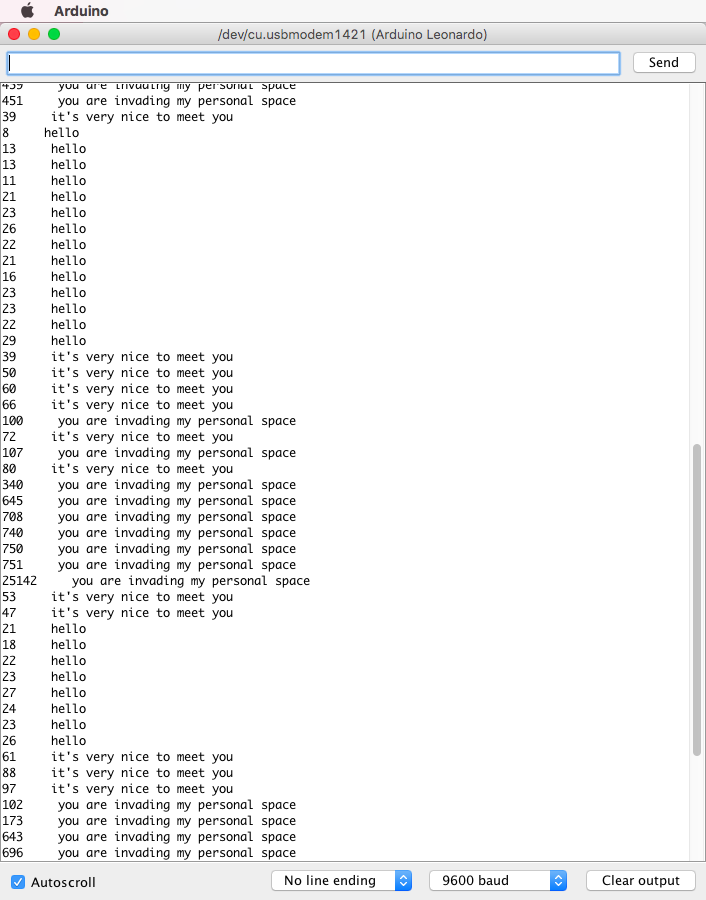

# Week 4

### Lab

#### 1. Hooking Up a Servo
  
[PWM Servo turning at 50, 90, and 180 degrees Video](https://youtu.be/bxg9C60vFo4)  
  
The Arduino script for this activity is saved [here](../Week4/servoHookup).

#### 2. Hooking Up a Motor
  
[Motor Video](https://youtu.be/AdN7thnQjhQ)  
  
I spent quite a while trying to make the motor move and turns out that it was because one of the wires was faulty. But on the bright side, I was able to learn a debugging technique of using a multimeter to check the circuit and the components. Arduino script for this activity is saved [here](../Week4/motorHookup).

#### 3. Hooking Up a MPR121
  
[MPR121 Video](https://youtu.be/EeZy3py5RHo)  
  
The Arduino script for this activity is saved [here](../Week4/mpr121).

#### 4. Using the Capsense Library
  
[Capsense Library with Digital Pin Video](https://youtu.be/LZ6MfvpDcZk)  
  
I first tested out the Capsense library with a very simple circuit and script (an extract is shown below) using digital pins which is saved [here](../Week4/capSensorDigital). 
  
    if (total > 200) {
      digitalWrite(6, HIGH);
    } else {
      digitalWrite(6, LOW);
    } 
  
[Capsense Library with PWM Video](https://youtu.be/plQRlMisgo8)
  
 
  
I then tested out the same library using the PMW pin 6 to adjust the LED brightness depending on the proximity of an object to the copper tape. It is a mini interactive piece called Space Invader and notifies you on the Serial Monitor, if you are invating its personal space (as shown in the image above). The Arduino script for this is saved [here](../Week4/capSensorPWM).

    
